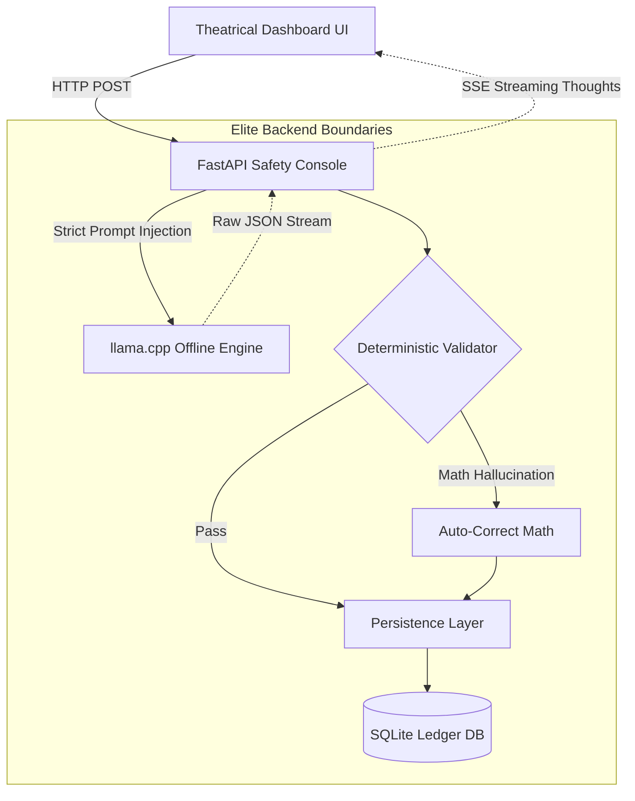

# SabiTrade: The Offline Bookkeeper

SabiTrade is designed to bring robust, AI-powered bookkeeping to edge environments without internet access. Instead of treating the AI as an uncontrolled "chatbot", SabiTrade uses a local `llama-server` in a strict **Safety Console Middleware**, creating a production ready transaction pipeline.

## The Architectural Moat

SabiTrade implements a **Deterministic Safety Boundary**:
1. **Strict JSON Parsing**: The AI is forced to extract entities into a predefined schema.
2. **Human-in-the-Loop Validation**: Python logic recalculates the math. If the LLM hallucinates, the Safety Console corrects it before saving.
3. **Append-Only Ledger Persistence**: All verified transactions are written to a local SQLite database, establishing a regulatory-compliant audit trail.

## System Architecture



## The UX

It is paramount to see the backend thinking. The SabiTrade UI features a **Live Streaming Thought Trace** terminal. When a user inputs a complex trade string, the UI visually streams the agent's internal monologue (parsing, validating, correcting) via Server-Sent Events (SSE). 

## Setup Instructions

1. Compile and download the quantized model for `llama.cpp` locally (ensure `llama-server` is in the `ADTC_Submission/llama.cpp/build/bin/` path).
2. Execute the elite startup script:
   ```bash
   ./run_demo.sh
   ```
3. Watch the UI open automatically and process trades securely, locally, and reliably.
